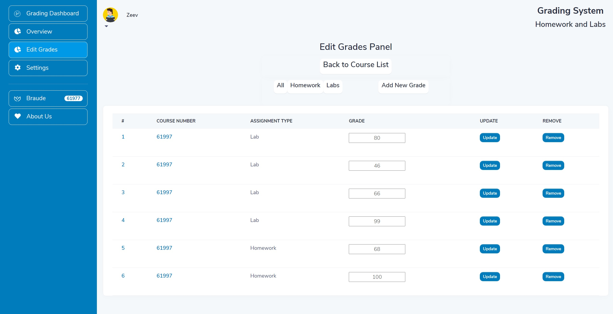

# Course Grading System

 

### Brief
```
Implementation of a Course Grading System - 
ReactJS Client, ExpressJS Server and MongoDB Atlas Database. Mobile Responsive.

DISCLAIMER:
This project is non-profit and is intended to serve for educational purposes only.
It is not meant to infringe copyright rights by any means.
Please notify the repository owner of any infringements and they will be removed.
```



### Prerequisites and Libraries
- ReactJS
- ExpressJS
- NPM
- Yarn

### Installing and Running
- Clone the Project
```
git clone https://github.com/RazMalka/GradingSystem.git
cd GradingSystem
```
- Install and Execute Client
```
cd client
yarn install
yarn start
```
- Install and Execute Server
```
cd server
npm install
npm start
```

### Usage Example
Main Page -> Login 
- Student Login:\
USERNAME: David\
PASSWORD: 4321\
Main Page -> View Grades -> Course #61997\
Main Page -> Settings -> Update Email\
Main Page -> Logout

Main Page -> Login
- Lecturer Login:\
USERNAME: Alex\
PASSWORD: 1234\
Main Page -> Edit Grades -> Course #61997 -> David\
Main Page -> Settings -> Update Password\
Main Page -> About Us
